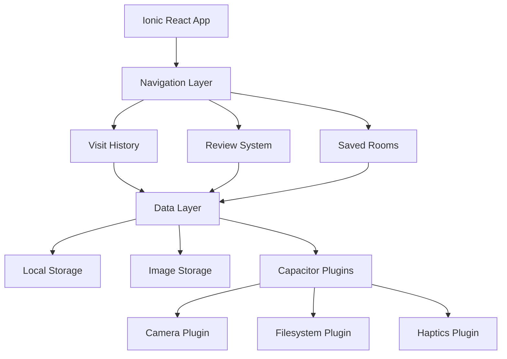
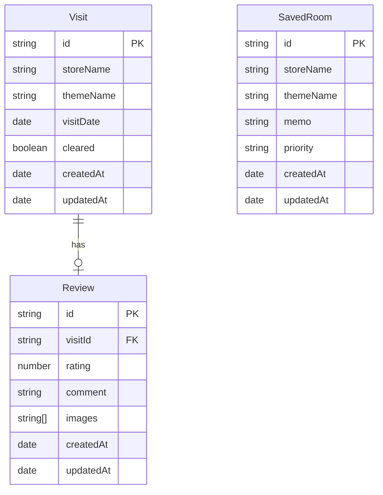

# Design Document

## Overview

The escape room tracker feature will be built as a comprehensive mobile-first application using the existing Ionic React + Capacitor stack. The design emphasizes a cozy, warm user experience with intuitive navigation and rich multimedia support. The architecture follows a modular component-based approach with local storage for offline capability and optional cloud sync for data persistence.

## Architecture

### High-Level Architecture



### Technology Stack Integration

- **Frontend Framework**: Ionic React with TypeScript
- **Routing**: React Router (existing v5 setup)
- **Styling**: SCSS with Ionic CSS variables for theming
- **State Management**: React Context API with useReducer for complex state
- **Data Persistence**: Capacitor Preferences API for structured data, Filesystem API for images
- **Native Features**: Capacitor Camera, Haptics, and Filesystem plugins
- **Testing**: Vitest for unit tests, Cypress for E2E testing

## Components and Interfaces

### Core Data Models

```typescript
interface EscapeRoom {
  id: string;
  storeName: string;
  themeName: string;
  createdAt: Date;
  updatedAt: Date;
}

interface Visit extends EscapeRoom {
  visitDate: Date;
  cleared: boolean;
  review?: Review;
}

interface Review {
  id: string;
  visitId: string;
  rating: number; // 1-5 scale
  comment: string;
  images: string[]; // file paths
  createdAt: Date;
  updatedAt: Date;
}

interface SavedRoom extends EscapeRoom {
  memo: string;
  priority: 'low' | 'medium' | 'high';
}
```

### Component Architecture

#### Navigation Components
- **TabNavigation**: Bottom tab bar with Visit History, Saved Rooms, and Add New sections
- **HeaderComponent**: Consistent header with search and filter capabilities

#### Visit History Components
- **VisitHistoryList**: Scrollable list of past visits with summary cards
- **VisitCard**: Individual visit display with quick stats and thumbnail
- **VisitDetail**: Full visit information with review display
- **VisitForm**: Form for creating/editing visit records

#### Review Components
- **ReviewForm**: Comprehensive review creation with rating, text, and image upload
- **ReviewDisplay**: Read-only review presentation with image gallery
- **RatingComponent**: Interactive star rating system
- **ImageGallery**: Swipeable image viewer with zoom capabilities

#### Saved Rooms Components
- **SavedRoomsList**: Grid/list view of saved rooms with memo previews
- **SavedRoomCard**: Individual saved room with memo and priority indicator
- **SavedRoomForm**: Form for adding/editing saved rooms and memos

#### Shared Components
- **CozyButton**: Styled button component with haptic feedback
- **ImagePicker**: Camera/gallery selection with preview
- **SearchFilter**: Combined search and filter interface
- **EmptyState**: Friendly empty state illustrations and messages

### Service Layer

```typescript
interface DataService {
  // Visit operations
  getVisits(): Promise<Visit[]>;
  createVisit(visit: Omit<Visit, 'id'>): Promise<Visit>;
  updateVisit(id: string, updates: Partial<Visit>): Promise<Visit>;
  deleteVisit(id: string): Promise<void>;
  
  // Review operations
  createReview(review: Omit<Review, 'id'>): Promise<Review>;
  updateReview(id: string, updates: Partial<Review>): Promise<Review>;
  
  // Saved rooms operations
  getSavedRooms(): Promise<SavedRoom[]>;
  createSavedRoom(room: Omit<SavedRoom, 'id'>): Promise<SavedRoom>;
  updateSavedRoom(id: string, updates: Partial<SavedRoom>): Promise<SavedRoom>;
  deleteSavedRoom(id: string): Promise<void>;
  
  // Image operations
  saveImage(imageData: string): Promise<string>;
  getImage(path: string): Promise<string>;
  deleteImage(path: string): Promise<void>;
}
```

## Data Models

### Storage Strategy

**Structured Data**: Capacitor Preferences API for JSON serialization
- Visits stored as `visits` key with array of Visit objects
- Saved rooms stored as `savedRooms` key with array of SavedRoom objects
- App settings stored as `appSettings` key

**Image Storage**: Capacitor Filesystem API
- Images stored in `DOCUMENTS/escape-room-tracker/images/` directory
- Filename format: `{timestamp}_{uuid}.jpg`
- Thumbnail generation for performance optimization

### Data Relationships



## Error Handling

### Error Categories and Strategies

1. **Storage Errors**
   - Graceful degradation with in-memory fallback
   - User notification with retry options
   - Automatic data recovery attempts

2. **Image Handling Errors**
   - Camera permission handling with user guidance
   - File system errors with cleanup and retry
   - Image compression fallback for large files

3. **Validation Errors**
   - Real-time form validation with helpful messages
   - Required field highlighting with cozy error styling
   - Data integrity checks before save operations

4. **Network Errors** (future cloud sync)
   - Offline-first approach with sync queue
   - Conflict resolution strategies
   - User notification of sync status

### Error UI Components

```typescript
interface ErrorBoundaryProps {
  fallback: React.ComponentType<{error: Error}>;
  onError?: (error: Error) => void;
}

interface ToastService {
  showSuccess(message: string): void;
  showError(message: string): void;
  showWarning(message: string): void;
}
```

## Testing Strategy

### Unit Testing Approach
- **Components**: React Testing Library for component behavior
- **Services**: Mock Capacitor plugins for data operations
- **Utilities**: Pure function testing for data transformations
- **Hooks**: Custom hook testing with renderHook

### Integration Testing
- **Data Flow**: End-to-end data operations from UI to storage
- **Navigation**: Route transitions and state persistence
- **Image Handling**: Camera integration and file operations

### E2E Testing Scenarios
- Complete visit creation workflow
- Review creation with image upload
- Saved room management
- Search and filter functionality
- Offline usage scenarios

### Testing Configuration
```typescript
// Test utilities for consistent setup
interface TestProviders {
  DataProvider: React.FC<{children: React.ReactNode}>;
  NavigationProvider: React.FC<{children: React.ReactNode}>;
  ThemeProvider: React.FC<{children: React.ReactNode}>;
}
```

## Cozy Design System

### Visual Design Principles

**Color Palette**:
- Primary: Warm amber (#F59E0B) for main actions
- Secondary: Soft sage green (#10B981) for success states
- Accent: Gentle coral (#F87171) for highlights
- Neutral: Warm grays (#F3F4F6, #9CA3AF, #374151)
- Background: Cream white (#FFFBEB) for main areas

**Typography**:
- Headers: Inter font family, medium weight
- Body: Inter font family, regular weight
- Accent: Handwritten-style font for personal touches

**Spacing and Layout**:
- 8px base unit for consistent spacing
- Generous padding (16-24px) for comfortable touch targets
- Rounded corners (8-16px) for soft, friendly appearance
- Card-based layout with subtle shadows

### Interactive Elements

**Buttons**:
- Rounded corners with gentle gradients
- Haptic feedback on press
- Smooth scale animations
- Disabled states with reduced opacity

**Forms**:
- Floating labels with smooth transitions
- Soft focus states with warm accent colors
- Inline validation with gentle error styling
- Progress indicators for multi-step forms

**Navigation**:
- Bottom tab bar with icon animations
- Smooth page transitions
- Breadcrumb navigation for deep sections
- Pull-to-refresh with custom animations

### Responsive Considerations

- Mobile-first design with tablet adaptations
- Flexible grid system using CSS Grid and Flexbox
- Touch-friendly sizing (minimum 44px touch targets)
- Landscape orientation support
- Safe area handling for modern devices